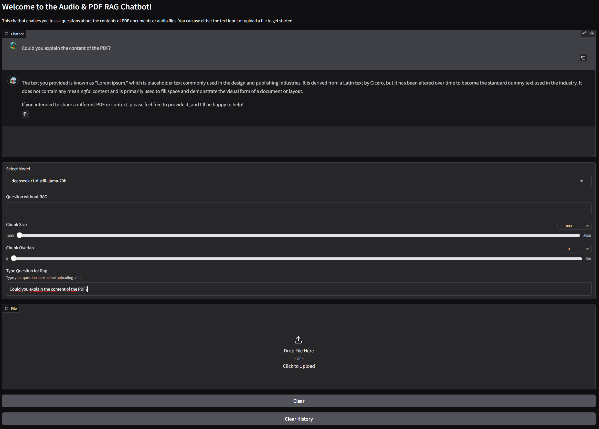

# 🎙️📄 Audio & PDF RAG Chatbot

This project is an **Audio & PDF Retrieval-Augmented Generation (RAG) Chatbot** built with **Gradio**, **Groq**, and **Ollama**.  
It allows users to upload **PDF documents** or **audio files** and ask natural language questions about their content.  

The chatbot supports multiple LLM backends (can add or remove models):
- **Groq-hosted models** (`llama3-70b-8192`, `llama-3.3-70b-specdec`, `deepseek-r1-distill-llama-70b`)  
- **Ollama models** (downloaded local models such as `deepseek-r1:14b`, `llama3:8b`)  

---

## ✨ Features
- 📄 Upload and query **PDF files**  
- 🎙️ Upload and query **audio files** (`.wav`, `.mp3`). JP for now but can be changed in audioRAG.py.
- 🔎 Retrieval-Augmented Generation (RAG) with chunk size and overlap control  
- 🤖 Choose between **Groq API models** and **local Ollama models**  
- 🧹 Conversation history reset & clear functions  
- 🎨 Custom avatars for user & bot in Gradio Chatbot  

### Gradio UI


---

## ⚙️ Installation

### Install dependencies
Make sure you have **Python 3.9+** installed.
Look how to download Ollama models and run it local.

```bash
pip install -r requirements.txt
```

### Install ffmpeg
This project uses `pydub`, which requires **ffmpeg**.  
Look for installation guides online if you want to use audio rag.
Download from [FFmpeg.org](https://ffmpeg.org/download.html) and update paths in your script:
```python
AudioSegment.converter = "C:\\ffmpeg\\ffmpeg.exe"
AudioSegment.ffmpeg = "C:\\ffmpeg\\ffmpeg.exe"
AudioSegment.ffprobe = "C:\\ffmpeg\\ffprobe.exe"
```

---

## 🔑 Environment Variables

Create a `.env` file in the project root with your Groq API key:

```env
GROQ_API_KEY=your_groq_api_key_here
```

---

## ▶️ Running the App

```bash
python app.py
```

This will launch a **Gradio UI** in your browser.

---

## 🖼️ UI Preview
- Upload PDF/audio file, adjust chunk size/overlap, select model.  
- Chat window: Interact with the bot.  
- Avatars: 🦙 llama bot + capybara user (custom images under `pictures/`).  

---

## 📂 Project Structure
```
├── app.py              # Main chatbot script
├── pdfRAG.py           # PDF retrieval logic
├── audioRAG.py         # Audio retrieval logic
├── requirements.txt    # Python dependencies
├── .env                # Environment variables (not committed to git)
├── examples/           # Audio and PDF examples
└── pictures/           # Avatar images for chatbot
```

---

## ✅ Example Usage
1. Select a model (`Groq` or `Ollama`).  
2. Type a question related to the file content.   
3. Upload a PDF or audio file.
4. Get contextualized answers using **RAG**.  
5. Or, type directly into the text box for normal LLM Q&A.  

---

## 📜 License
MIT License – feel free to use and modify.

---

## 🙌 Acknowledgments
- [Gradio](https://gradio.app/) for the UI  
- [LangChain](https://www.langchain.com/) for document loaders & text splitters  
- [Groq](https://groq.com/) & [Ollama](https://ollama.com/) for model inference  
